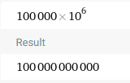
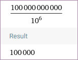

# Implementación token ERC-20

## `EIP`
Documento de diseño en donde se describe una nueva funcionalidad de ethereum, procesos y ambiente

## `Caracteristicas ERC-20`
- Estandar token fungible
- Representación en diferentes cosas
- Interoperabilidad con productos y servicios

## `Emitir tokens`
- Para emitir una cantidad de token debemos especificar el numero de decimales para su fraccionamiento.

## `Obtener la cantidad de tokens`
- El numero total de tokens es el numero de token emitidos divididos 
por 10 elevado a numero de decimales

